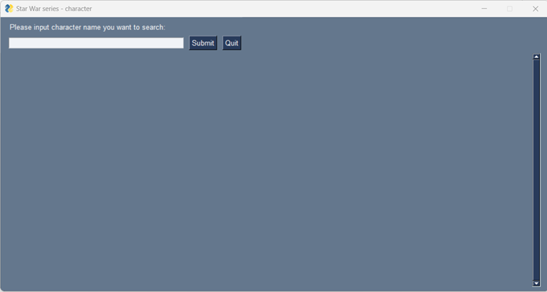
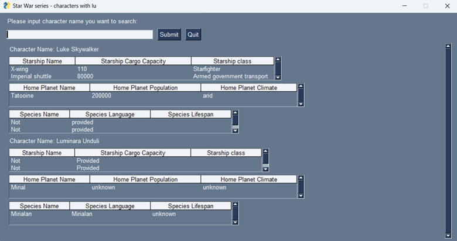
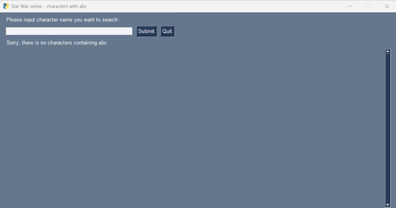

## swchar
This is a toy project with [Star Wars API](https://swapi.dev/).

## Introduction

This is an application to meeting the following requirements:

    Take a Star Wars character name, and returns the following information about the character:

      Starship:  Starship name, cargo capacity, and Starship class

      Home Planet:  Planet name, population, and climate

      Species: Name, language, and average lifespan

    Handle as few as one letter in the input

    If multiple characters are found, return in alphabetical order by character name

## Start application

There are two ways to start:

1 In windows, just download [the exe file](./src/dist/main.exe) to a target location in PC. Double click it and there will be a window pop out.

2 Use Python3 to run the application on all platforms. Followings are steps:

  &nbsp;&nbsp;2.1 Make sure to install all the required packages in the [requirement file](./src/requirements.txt) located in /src/requirements.txt.

  &nbsp;&nbsp;2.2 Run [main.py](./src/main.py) located in src/main.py

  &nbsp;&nbsp;2.3 The application window will pop out.

## How to use this application

The start point of the application is:

User can input any character name or part of name in the white input box. After that, user can click "Submit" button to get results from [Star Wars API](https://swapi.dev/):

User can input names and submit it again.

User can quit the application by click "Quit" button or "X" on the top right of the window.

Notice that: 

&nbsp;&nbsp;The searched string is shown on top of the windows, after "Star War Series - characters with "

&nbsp;&nbsp;For each character, the information starts with "Character Name: ", followed with three tables (star ship information, home planet informaiton, and species information).

&nbsp;&nbsp;If no character can be found, a message will be displayed:

&nbsp;&nbsp;Multiple starships will be displayed in the table.

&nbsp;&nbsp;If a section is empty, "Not provided" will be displayed in the related table.

&nbsp;&nbsp;If an error is returned from [Star Wars API](https://swapi.dev/), this error will be displayed.

## Known issues

1 If user input an empty character, [Star Wars API](https://swapi.dev/) should return all results (82). However, this application can only get 10 and display 10 characters. This might be due to the usage limitation of [Star Wars API](https://swapi.dev/).

2 "Not provided" is not display in a correct way.

3 Search time is long (5-10 sections). This time is also limited by [Star Wars API](https://swapi.dev/).

## Next steps

1 Fix [known issues](#known-issues).

2 Change the appearance of the application, like colors and background.

3 Add more features.
